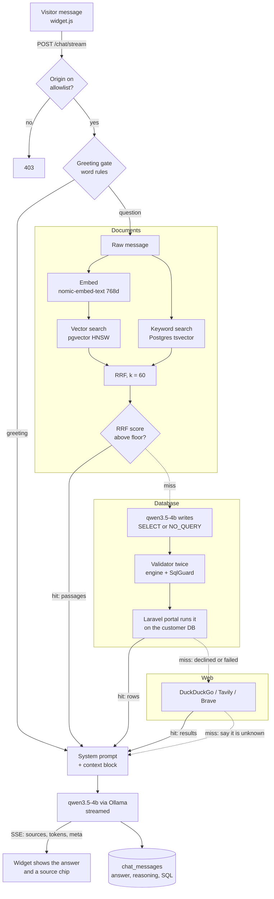
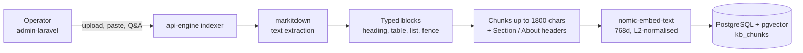
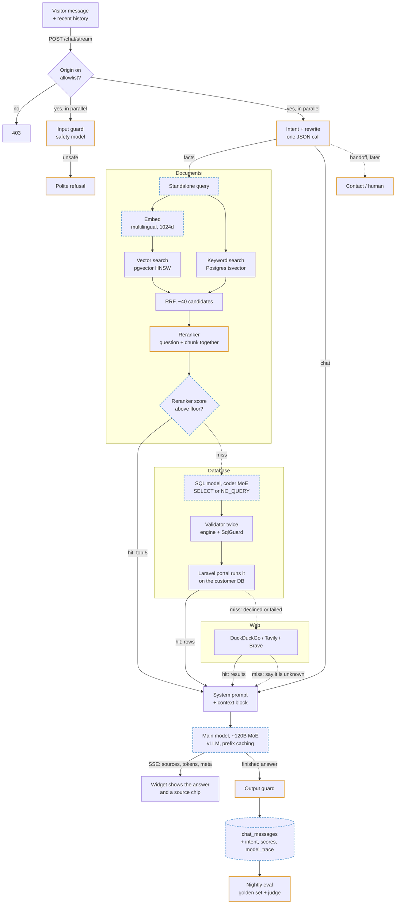
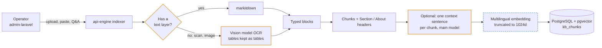

# Model Stack Review

The AI pipeline as it stands today, the pipeline planned for two clustered
DGX Sparks, and what changes between them.

Written 2026-09-15. `architecture.md` describes how each piece works; this
document is about which models do which job, and what is missing.

Figures for memory and latency are plan-grade estimates, to be replaced with
measurements when the hardware arrives.

---

## 1. Today

One 4B model does everything that needs a model except embedding.

| Role | Model | Served by |
|---|---|---|
| Chat answer | qwen3.5-4b | Ollama, through the bot's AI provider row |
| SQL generation | qwen3.5-4b (blank `sql_model_*` settings fall back to the bot's model) | Same |
| Embedding | nomic-embed-text, 768 dimensions | Ollama `/v1/embeddings` |
| Should we search at all | No model: word rules in `kb/gating.py` | Engine |
| Which source answers | No model: the bot's source order | Engine |
| Reranking | None | |
| Guardrail | None: origin allowlist and SQL validation only | |

### Chat path



### Ingestion path



### What is already right

These carry over unchanged, and several of them are unusual for a system this
young.

- **Hybrid retrieval with rank fusion.** Dense catches paraphrase, keyword
  catches product codes, RRF needs no calibration between them.
- **Structure-aware chunking with header lines.** The deterministic substitute
  for contextual retrieval.
- **`embedding_model` on every chunk.** A half-finished re-index cannot mix
  vector spaces.
- **A source order the operator sets.** An answer can always be explained.
- **SQL validated twice**, by the engine and by `SqlGuard`, against a read-only
  account.
- **No source failure ends a conversation.**

### What is missing

Found while reading the code, in order of how much each costs answer quality.

1. **Follow-up questions search the wrong text.** Every source receives
   `req.message` alone (`routers/chat.py`, `sources/attempts.py`). History
   reaches the chat model but never retrieval or SQL generation. "How much is
   the X200?" followed by "and the warranty?" searches for "and the warranty?".
2. **The relevance floor is set on an RRF score.** RRF is a rank sum, not a
   relevance measure, so the floor cannot say "this passage answers the
   question". Two migrations have already re-tuned it
   (`raise_the_relevance_floor`, `lift_the_relevance_floor_above_noise`). The
   cascade's first-hit-wins rule depends on documents reporting a miss honestly,
   so an uncalibrated floor decides whether the database and web ever get a turn.
3. **No reranker.** Recorded as a non-goal because it needed PyTorch in the
   engine. Served over HTTP by vLLM, TEI or llama.cpp, it needs none.
4. **Embedding is English-centric.** nomic-embed-text v1.5 was trained mostly on
   English; Malay and mixed-language questions retrieve worse.
5. **Scanned PDFs produce no text.** markitdown reads a text layer; a scan has
   none.
6. **No safety model** on what visitors send or what the bot says.
7. **No measurement.** Nothing records which model, which scores or which
   decision produced an answer, and there is no fixed set of questions to judge
   a model change against.

---

## 2. Proposed

Blue dashed outlines are stages that exist today and change; amber outlines are
new.

### Chat path



### Ingestion path



---

## 3. What changes

| Stage | Today | Proposed | Why |
|---|---|---|---|
| Upload parsing | markitdown, text layer only | Vision OCR when there is no text layer | Scans currently index as nothing |
| Chunk context | Section / About headers | Kept, plus an optional model-written sentence | Was blocked only by model size |
| Embedding | nomic-embed-text, 768d | Multilingual (Qwen3-Embedding class), truncated to 1024d | Malay and mixed queries; HNSW indexes at most 2,000 dims |
| Greeting gate | Word rules | Intent call; rules kept as the fast path | Knows chat from facts from image |
| Follow-ups | Raw message searched | Standalone query rewritten in the intent call | Fixes "and the warranty?" |
| Candidates | Top k by RRF | ~40 by RRF, then reranked to 5 | Largest retrieval gain per GB |
| Relevance floor | RRF score | Reranker score | A floor that means "answers the question" |
| Source choice | Operator order | Unchanged | Keeps answers explainable |
| SQL | Chat model | Dedicated coder MoE, same validators | Multi-join and dialect accuracy |
| Safety | Origin + SQL rules | + input guard, + output guard | Multi-tenant liability |
| Answer | qwen3.5-4b, Ollama | ~120B-class MoE in NVFP4, vLLM | The main quality jump |
| Logging | Answer, reasoning, SQL | + intent, scores, model per role | "Why did it say that" |
| Evaluation | None | Golden set per bot, nightly judge | Model changes become measurable |
| Image | None | Separate diffusion service | New capability, last |

---

## 4. Embedding and reranking are different jobs

Both read text and produce a number, which is why they look like one model.

- **An embedding model reads each text alone.** A chunk becomes a vector once,
  at indexing time; a question becomes a vector at search time; similarity is
  arithmetic between them. Because chunk vectors are stored, a search can
  compare against the whole corpus in milliseconds. The price is that the model
  never sees question and chunk together, so it matches topic, not answer.
- **A reranker reads the question and one chunk together** and returns how well
  that chunk answers that question. Nothing can be precomputed, so it is far too
  slow for the whole corpus, and exactly right for the 30 to 40 candidates
  retrieval already found.

Retrieval finds what might be relevant. Reranking decides what is.

---

## 5. The intent model, and the source order

The source-order design (`superpowers/specs/2026-09-14-answer-source-order-design.md`)
removed a model router, and not because it routed badly. An operator could not
configure it, predict it, or explain an answer that came from the wrong place.
An intent model that picks between the knowledge base and the database brings
that router back under another name.

**Recommendation: intent chooses the kind of reply; the operator's order still
chooses the source.**

| Verdict | Goes to | Operator control |
|---|---|---|
| `chat` | Main model, no source consulted | None needed |
| `facts` | The source cascade, in the bot's order, with the rewritten query | Source order, unchanged |
| `image` | Image service | Per-bot switch, off by default |
| `handoff` | Contact details or a human (later) | Per-bot switch |

Unsafe input is the guard's job, a different model with a different failure
cost, not an intent verdict.

This keeps what the source-order decision protected, because every verdict is
visible and each one maps to something an operator switched on. Three rules
keep it predictable:

1. **Structured output at temperature 0.** vLLM constrains the reply to the JSON
   schema, so it cannot narrate, and the same message gets the same verdict.
2. **Fail towards looking things up.** If the word rules call a message a
   question (it has a question mark) and intent says `chat`, treat it as
   `facts`. A wasted retrieval is cheaper than an invented answer.
3. **The verdict is logged** on the message and shown in the logs screen.

One call does both jobs, so the rewrite costs nothing extra:

```json
{
  "intent": "facts",
  "query": "What is the warranty period for the X200 air fryer?",
  "language": "ms"
}
```

### What the extra calls cost

Guesses to replace with measurements.

| Step | Adds before first token | When |
|---|---|---|
| Input guard, 4B | 0.1 to 0.3 s | Every message, parallel with intent |
| Intent + rewrite, 3B-active MoE | 0.3 to 0.8 s | Every message |
| Rerank ~40 candidates | 0.2 to 0.5 s | When documents take a turn |
| SQL generation | 0.5 to 1.5 s | When the database takes a turn |

---

## 6. Model roster

Nine jobs need a model. On the Sparks they run as six deployments, because
intent and SQL share one model, the answer model also judges evaluations, and
one guard model checks both directions at first. On the 8 GB machine, three
models cover every job that has a stand-in.

| Job | Setting | On the Sparks | Alternative | On the 8 GB machine now | Served by |
|---|---|---|---|---|---|
| Answer | The bot's AI provider | Qwen3.5-122B-A10B, NVFP4 | gpt-oss-120b | qwen3.5-4b | vLLM, node A |
| Embedding | `embedding_*` | Qwen3-Embedding-4B, 1024d | bge-m3 | nomic-embed-text | vLLM `/v1/embeddings` |
| Reranker | `rerank_model_*` | Qwen3-Reranker-4B | bge-reranker-v2-m3 | bge-reranker-v2-m3; a chat model cannot stand in | vLLM `/v1/rerank`, llama.cpp `--reranking` |
| Intent + rewrite | `intent_model_*` | Qwen3.5-35B-A3B | A fine-tuned Qwen3.5-4B | qwen3.5-4b | vLLM, node B, shared with SQL |
| SQL | `sql_model_*` | Qwen3-Coder-30B-A3B, or share Qwen3.5-35B-A3B | | qwen3.5-4b | vLLM, node B |
| Input guard | `guard_model_*` | Qwen3Guard-Gen-4B | Llama Guard 4 12B | Qwen3Guard-Gen-0.6B, or qwen3.5-4b with a prompt | vLLM, node B |
| Output guard | `guard_model_*` | Qwen3Guard-Gen-4B on the finished answer | Qwen3Guard-Stream-4B, checks while tokens stream | Same as input guard | vLLM, node B |
| Vision OCR | `vision_model_*`, later | Qwen3-VL-8B | dots.ocr, olmOCR-2 | None; scans stay unsupported | vLLM, node B |
| Judge, for evals | `judge_model_*`, later | The answer model, run overnight | A hosted API | A hosted API; a 4B judges poorly | Reuses node A |
| Image | Deferred | FLUX.1-dev or Qwen-Image | | | diffusers or ComfyUI |

A role left blank falls back to the bot's own model, except the reranker and
vision, which have no stand-in and skip their stage instead.

---

## 7. Two DGX Sparks

Each node has 128 GB of unified memory with about 273 GB/s bandwidth. Decode
speed follows active parameters, so every generative role is a mixture-of-experts
model or a small dense one.

The nodes run as two independent servers, not one tensor-parallel cluster.
Nothing planned needs more than one node's memory, and splitting a model across
the 200GbE link adds latency to every token.

| | Node A: conversation | GB | Node B: everything else | GB |
|---|---|---|---|---|
| System | OS, drivers | 8 | OS, drivers | 8 |
| | Main model, ~120B MoE NVFP4 | 70 | Intent + SQL, ~30B-A3B MoE FP8 | 36 |
| | KV cache for concurrent chats | 40 | Embedding, 4 to 8B | 16 |
| | | | Reranker, 4B | 8 |
| | | | Guard, 4B | 8 |
| | | | Vision OCR, 8B | 10 |
| | | | Image generation (deferred) | 30 |
| Headroom | | 10 | | 12 |

Candidates as of September 2026, to re-check before buying time on any of them:
Qwen3.5-122B-A10B (main), Qwen3.5-35B-A3B or Qwen3-Coder-30B-A3B (intent + SQL),
Qwen3-Embedding-4B or -8B, Qwen3-Reranker-4B or bge-reranker-v2-m3,
Qwen3Guard-Gen-4B.

On unified memory `--gpu-memory-utilization` is a fraction of all 128 GB, so
every vLLM process on a node needs an explicit share, and the shares must sum
below 1.

---

## 8. Order of work

**Now, on the 8 GB machine.**

1. Write the golden set: 50 to 100 questions per test bot with the expected
   source and answer, plus database questions with expected rows. Every later
   step is judged against it.
2. Log what decided each answer: model per role, retrieval scores, and later
   the intent verdict.
3. Add the rerank stage behind `rerank_model_*` settings, the way `sql_model_*`
   works: blank means today's behaviour. bge-reranker-v2-m3 (~0.6B) fits now,
   served by llama.cpp `llama-server --reranking` or Hugging Face TEI.
4. Move the relevance floor onto the reranker score.
5. Build the intent + rewrite contract against the 4B model. The contract
   outlives the model.

**When the Sparks arrive.**

6. Stand up one vLLM process per role; run the golden set against two or three
   candidates for each.
7. Change the embedding model, truncate to 1024 dimensions, rebuild the index.
8. Add the input guard, then the output guard on finished answers.
9. Vision OCR for scanned uploads. Image generation is deferred.
